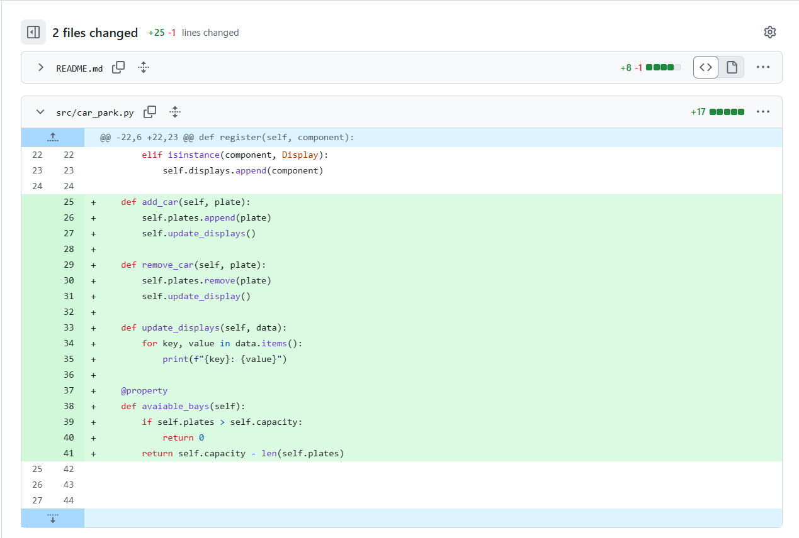
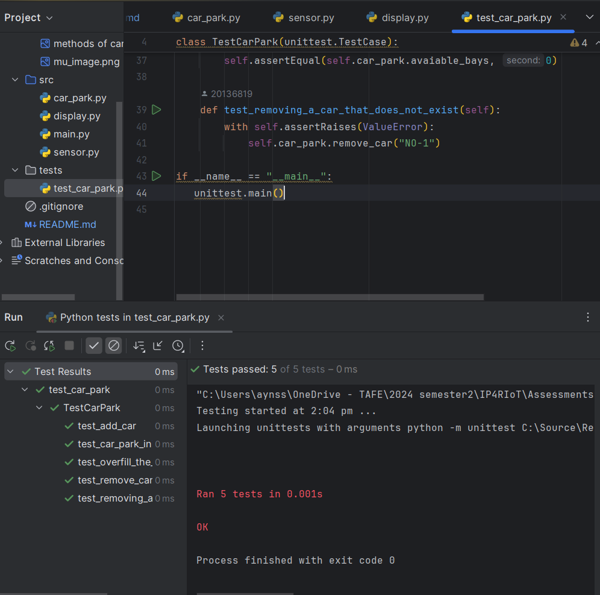

# CarParkSystem
car park project

| Class Name | Attributes | Methods |
| ---------- | ---------- | ------- |
| `CarPark`    |            |         |
| `Sensor`     |            |         |
| `Display`    |            |         |

Ensure that you have completed the previous steps and created the appropriate tags. 

Q. Which class is responsible for the number of available bays (and why)?
    CarPark class
Q. Which class is responsible for the current temperature (and why)?
    Sensor class
Q. Which class is responsible for the time (and why)?
    Display class

Add a screenshot of the GitHub repository after pushing the tag, showing the CarPark class with the new methods:

Review Questions

What is the difference between an attribute and a property? Answer here...
Attributes: These are variables or data fields associated with an instance or class. 
They are typically accessed directly (e.g., object.attribute). 
Attributes do not have any getter or setter logic by default—they simply hold values.

Properties: Properties provide controlled access to instance attributes by using the @property decorator, 
which allows you to define methods that get and set an attribute's value, while still allowing it to be accessed like an attribute. 
This is helpful if you want to add logic for validation, transformation, or other actions when an attribute is accessed or modified.

Why do you think we used a dictionary to hold the data we passed the display? List at least one advantage and one disadvantage of this approach. 
Advantages:
Flexibility: A dictionary allows you to store different types of data in a single structure without the need to define a strict schema. 
Each key can represent a unique attribute of the data, which can be accessed dynamically.

Disadvantages:
Lack of Structure: Dictionaries do not enforce any type or attribute constraints, 
which can make the data difficult to manage if the structure is complex or if certain keys are missing. 
This can lead to runtime errors or require extra checks for key existence.

Add a screenshot of the output of the unit tests

