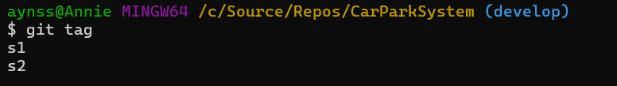

# CarParkSystem
car park project

| Class Name | Attributes | Methods |
| ---------- | ---------- | ------- |
| `CarPark`    |            |         |
| `Sensor`     |            |         |
| `Display`    |            |         |

Ensure that you have completed the previous steps and created the appropriate tags. 

Q. Which class is responsible for the number of available bays (and why)?
    CarPark class
Q. Which class is responsible for the current temperature (and why)?
    Sensor class
Q. Which class is responsible for the time (and why)?
    Display class